> [!NOTE]  
> Este es el Markdown Realizado despues de la practica, no contiene nada hecho posteriormente, solo arregla y añade las imagenes al archivo original

# PRACTICA 3
## Por David Rubio 

IMPORTANTE: No me pude conectar al servidor de la practica asi que lo realizare en el servidor de clase

### Sitios Web - Configuracion Inicial
* Creamos las carpetas de los sitios web en '/var/www'
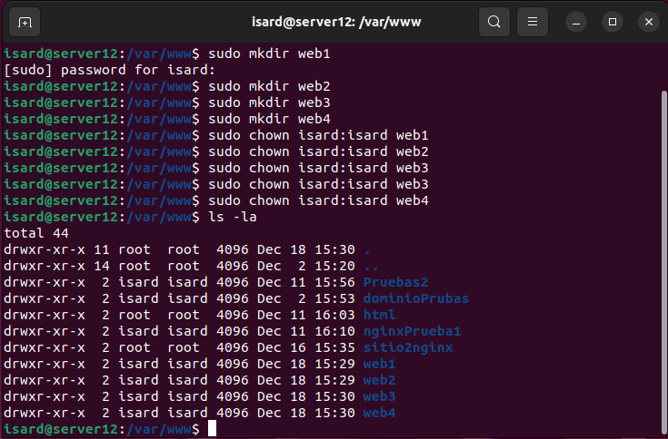
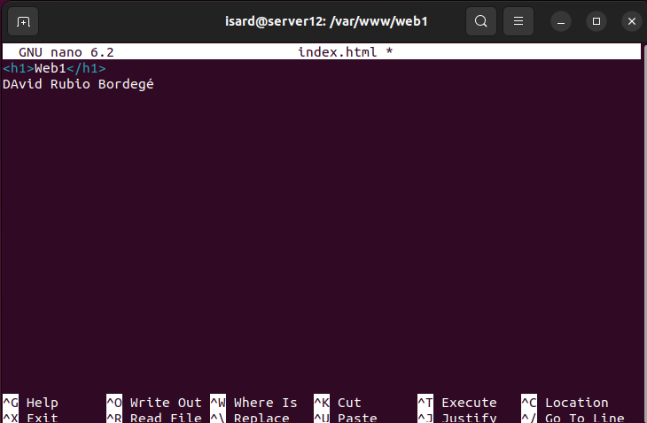
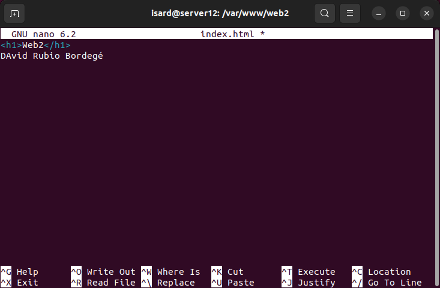
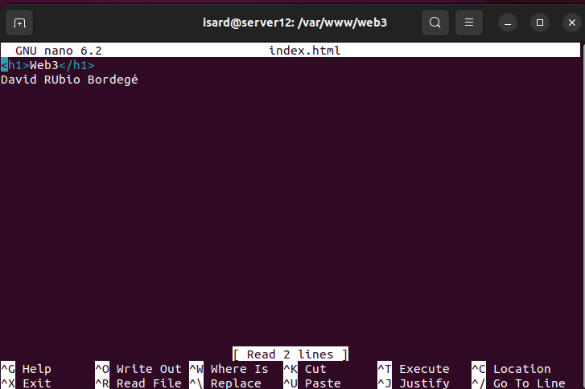
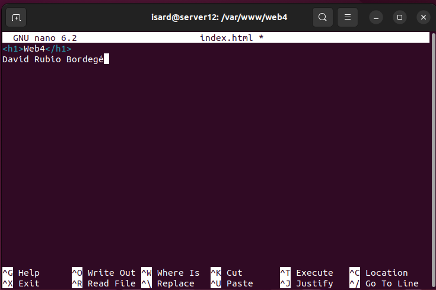
* Modificamos el archivo '/etc/hosts' de la maquina cliente
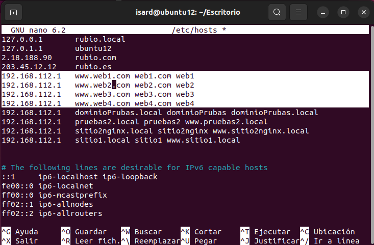
### Sitio 1
* Inicializamos el servicio de apache2 'sudo systemctl start apache2'
* Nos movemos a la carpeta '/etc/apache2/sites-available/'
* Creamos un fichero llamado web1.conf y lo rellenamos
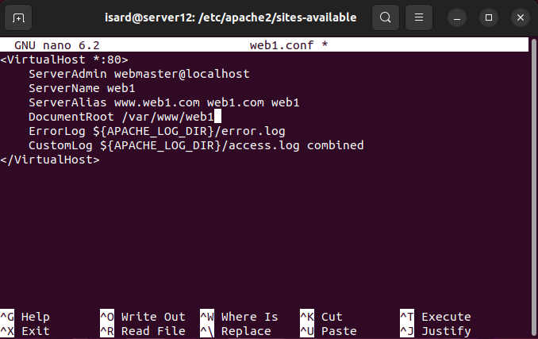
* Activamos el sitio con 'sudo a2ensite web1.conf'
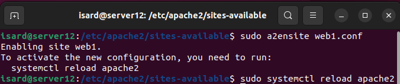
* Recargamos el servidio apache2
* Comprobamos que funciona
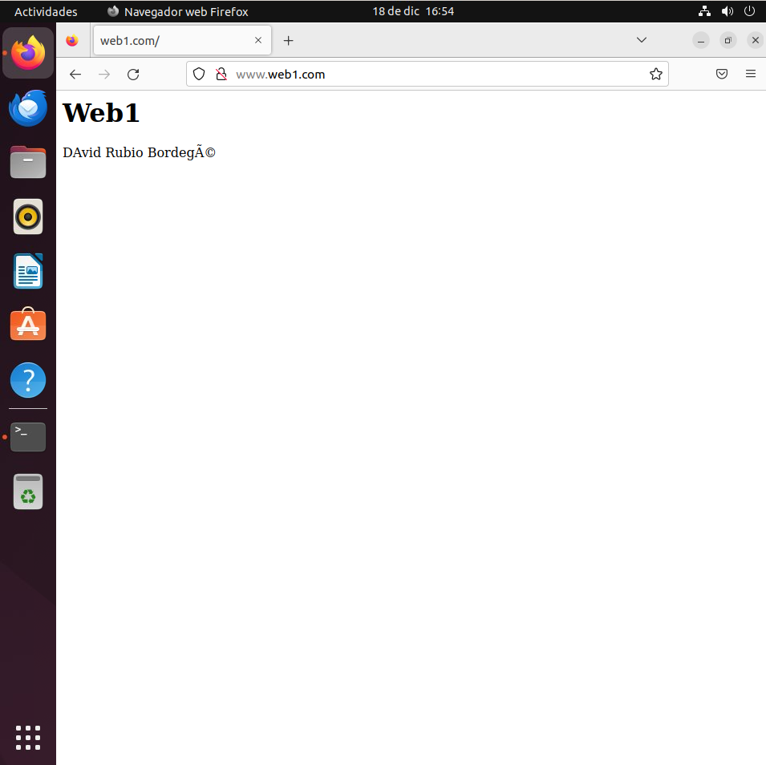
### Sitio 2
Exactamente Igual que el Sitio 1
* En la carpeta '/etc/apache2/sites-available/'
* Creamos un fichero llamado web2.conf y lo rellenamos
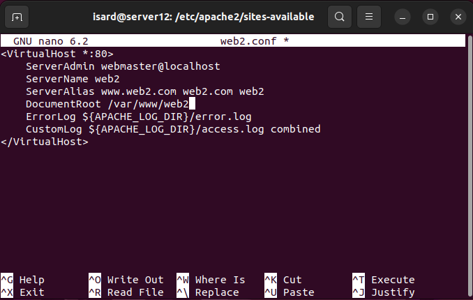
* Activamos el sitio con 'sudo a2ensite web2.conf'
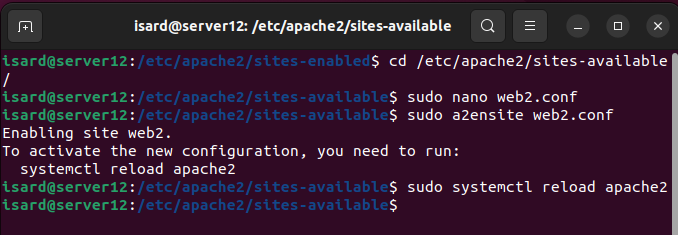
* Recargamos el servidio apache2
* Comprobamos que funciona

### Sitio 3
> [!NOTE]  
> Como estoy usando mi maquina virtual no necesito instalar ni activar ssl para las claves, se haria de la siguiente forma:
* Primero instalaria open ssl en la maquina con 'sudo apt install openssl'
* Luego con el servidor avierto activaria el modulo de ssl con 'sudo a2enmod ssl'
* Ahora creamos el cerfificado y la clave con el siguiente comando
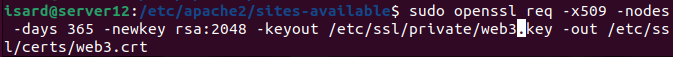
* Creamos el archivo web3.conf en '/etc/apache2/sites-available/'
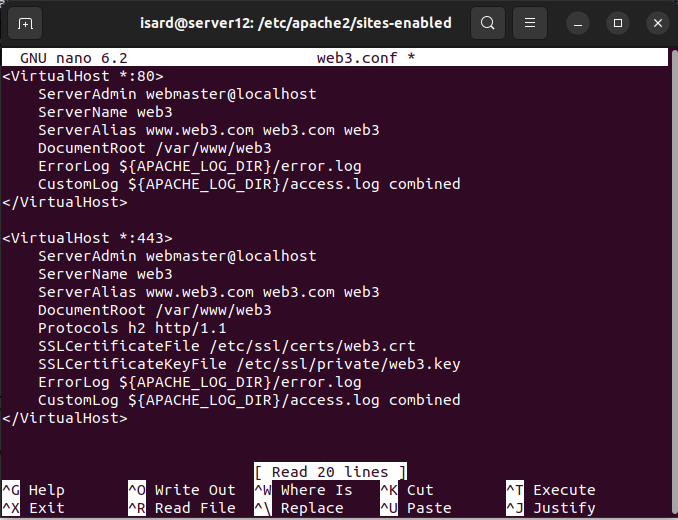
* Recargamos el servicio y comprobamos que funcione
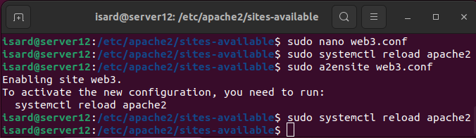
* En este caso algo va mal y no abre el puerto 443, por lo que el https jamas carga
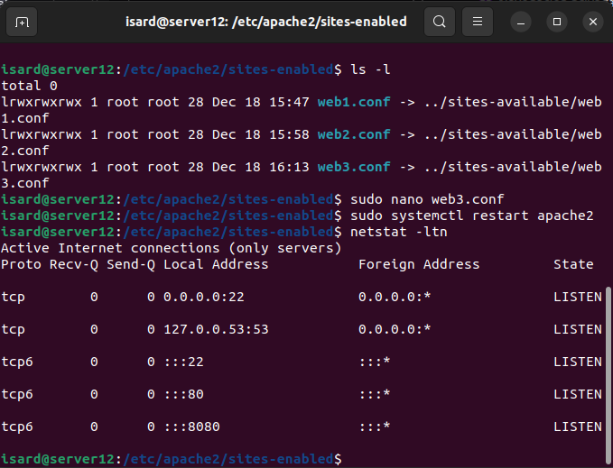
### Sitio 4
* Inicializamos el servicio de apache2 'sudo systemctl start nginx'
* Nos movemos a la carpeta '/etc/anginx/sites-available/'
* Creamos un fichero llamado web4 y lo rellenamos
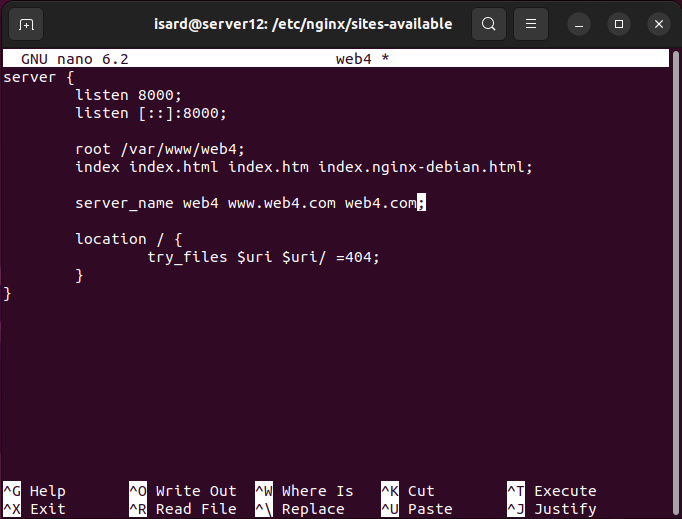
* Activamos el sitio con una tuberia
* Recargamos el servidio nginx
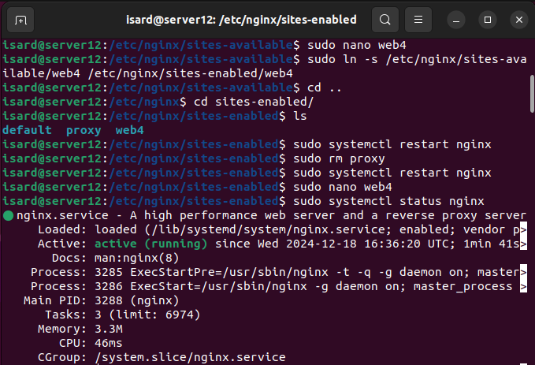
* y Comprobamos que funciona
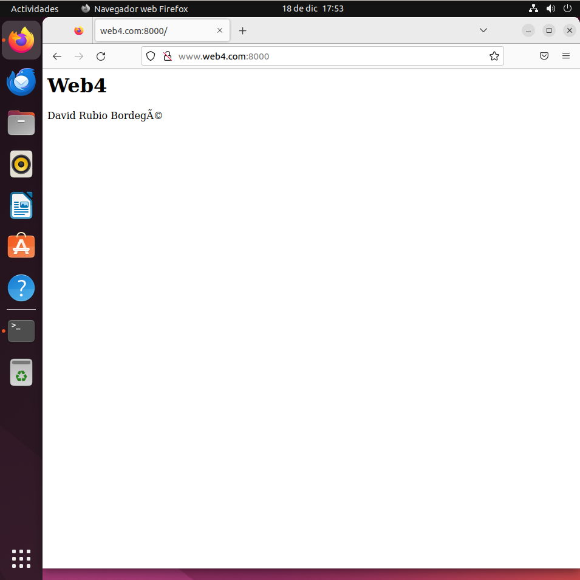
### Proxy
* No me ha dado tiempo a terminarlo, esto es el archivo de configuracion que tenia echo antes de la entrega
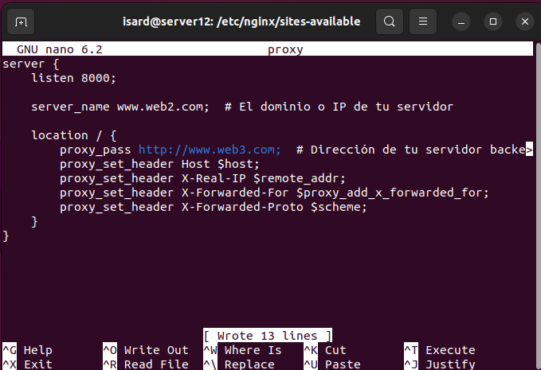

