# PRACTICA DESPLIEGUE Ubuntu
## Por David Rubio 

Para realizar este trabajo se realizara una estructura que consistira de:

* Una aplicacion PHP que sera levantada por un servidor apache en el puerto 8080.
* Una aplicacion Node que sera levantada por el propio node en el pueto 3000.
* MySQL con dos bases de datos distintas para cada aplicacion.
* Un servidor NginX que funcionara como proxy y que enviara ambas aplicaciones por el puerto 80.

### INSTALACION MYSQL Y CONFIGURACION

Para instalar mysql necesitaremos ejecutar el siguiente comando 

`Sudo apt install mysql-server`

> [!NOTE]  
> En esta practica ya viene instalado de serie

Una vez instalado podemos proceder a configurarlo, para ello accederemos a mysql como root con `Sudo mysql` desde ahi crearemos los usuarios necesarios y las databases necesarias que nos pida el projecto. Posteriormente le daremos acceso a los usuarios para que puedan acceder a dicha base de datos.

* Creacion de Database: `CREATE DATABASE nombre_base_de_datos;`
* Creacion de usuario: `CREATE USER 'nombre_usuario'@'localhost' IDENTIFIED BY 'contraseña';`
* Otorgar permisos a usuario sobre base de datos: `GRANT ALL PRIVILEGES ON nombre_base_de_datos.* TO 'nombre_usuario'@'localhost';`
* Flush de privilegios: `FLUSH PRIVILEGES;`

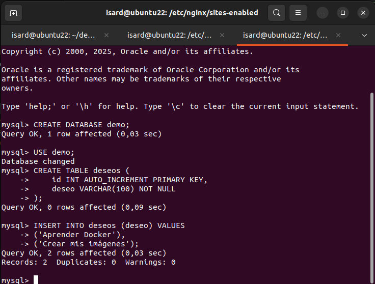

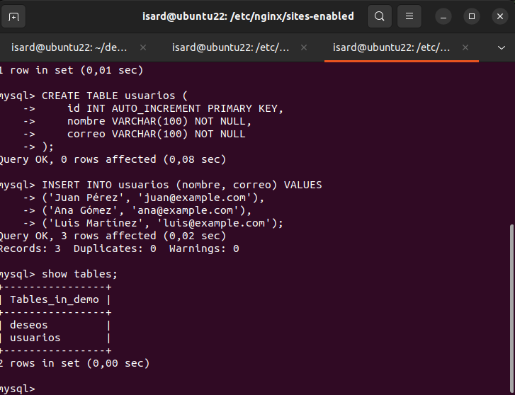

> [!NOTE]  
> Para el manejo de las bases de datos hemos creado un usuario llamado 'demo' con contraseña 'password'

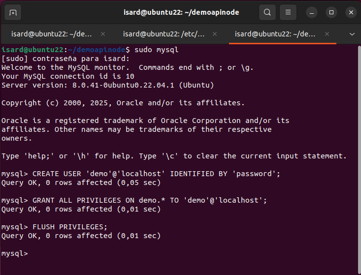

### CREACION DEL SERVIDOR DE NGINX (PROXY)

Empezamos dirigiendonos a la carpeta donde nginx tiene las configuraciones de sus sitios (/etc/nginx/sites-available) y crearemos nuestro script de proxy inverso. Finalmente añadiremos el archivo mediante enlace a (/etc/nginx/sites-available) mediante `sudo ln -s /etc/nginx/sites-available/proxy /etc/nginx/sites-enabled/proxy` y reiniciarmemos nginx con 'sudo sytemctl restart nginx'.

Codigo de configuracion del proxy:
`server {
    listen 80;
    server_name node.local;

    location / {
        proxy_pass http://localhost:3000;
        proxy_set_header Host $host;
        proxy_set_header X-Real-IP $remote_addr;
    }
}

server {
    listen 80;
    server_name php.local;

    location / {
        proxy_pass http://localhost:8080;
        proxy_set_header Host $host;
        proxy_set_header X-Real-IP $remote_addr;
    }
}`

El codigo escuchara por el puerto 3000 la aplicacion node y por el puerto 8080 la aplicacion php y los sirve por el puerto 80.

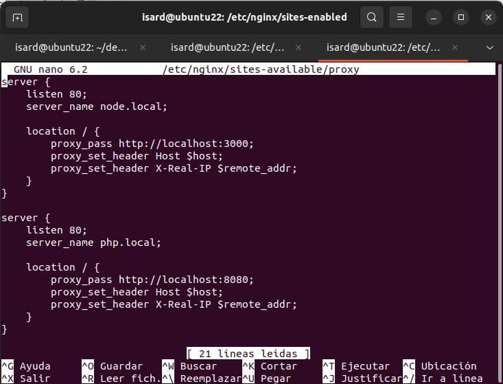

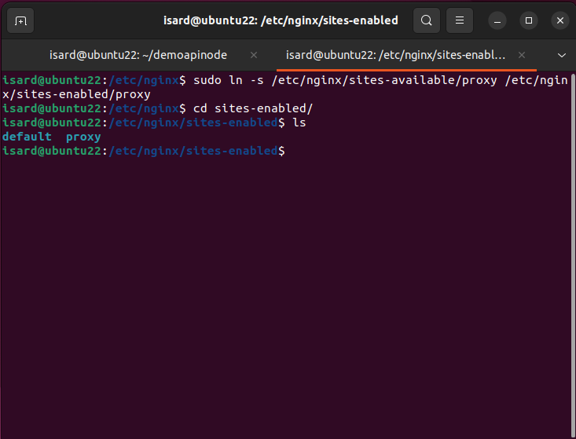

### CREACION DEL SERVIDOR DE NODE

Para crear el servidor de node, primero descargaremos la aplicacion con `git clone https://github.com/rafacabeza/demoapinode.git` en la carpeta que queramos (en mi caso en home). Finalmente instalaremos las dependencias de la apliacacion con `npm install` y levantaremos la aplicacion con `npm start`.  

> [!NOTE]  
> No sera necesario cambiar los puertos porque la aplicacion ya los tiene configurados

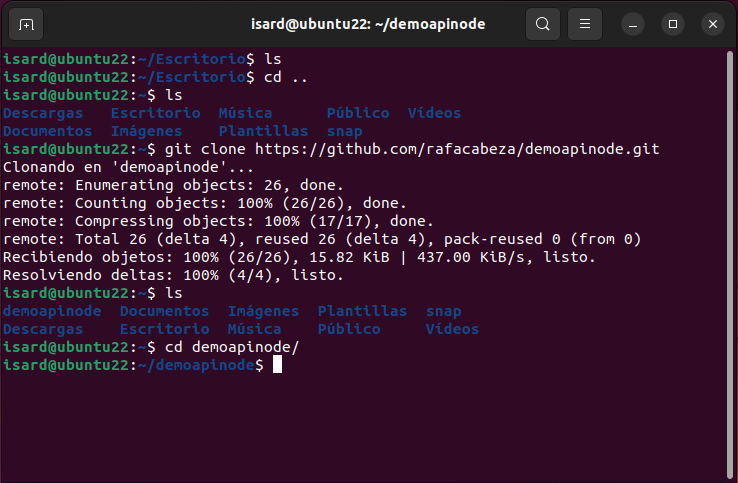

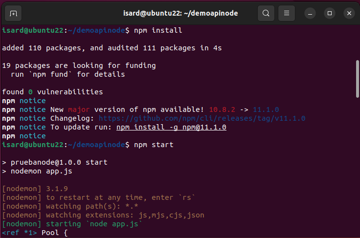

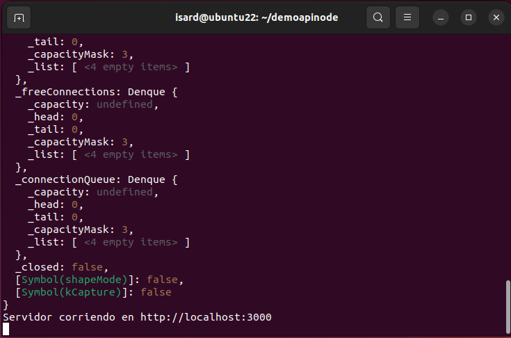

> [!NOTE]  
> Para el manejo de las bases de datos he cambiado el usuario a uno llamado 'demo' con contraseña 'password'

### CREACION DEL SERVIDOR DE APACHE

Finalmete toca la aplicacion php de apache. Primero importaremos al igual que en node desde git la aplicacion de php con `sudo git clone https://github.com/rafacabeza/demoappphp.git` pero esta vez lo haremos en la carpeta de (/var/www/html). Proseguiremos llendo a (/etc/apache2/sites-available) y creando el archivo de configuracion. Ahora iremos a (/etc/apache2/ports.conf) y cambiaremos los puertos a 8000. Finalmente tras crearlo ejecutaremos `sudo a2ensite demoappphp.conf` para activarla y recargamos apache con `sudo systemctl reload apache2`.

Codigo de configuracion:

`<VirtualHost *:8080>

        ServerName demoappphp

        ServerAdmin webmaster@localhost
        DirectoryIndex index.php
        DocumentRoot /var/www/html/demoappphp/app
        ErrorLog ${APACHE_LOG_DIR}/error.log
        CustomLog ${APACHE_LOG_DIR}/access.log combined
</VirtualHost>`

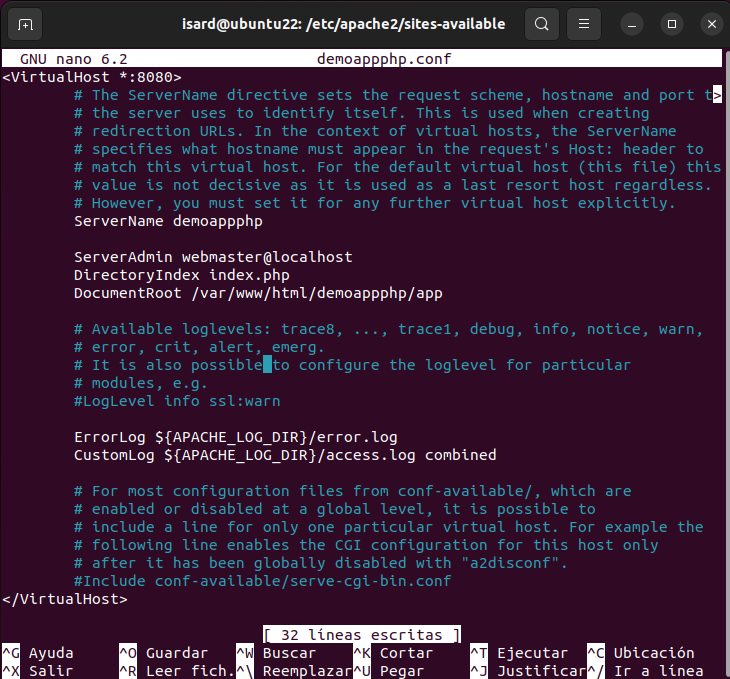

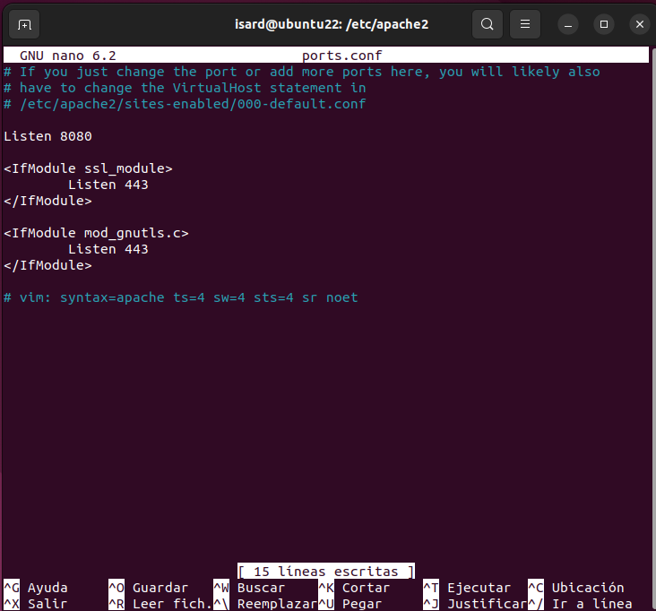

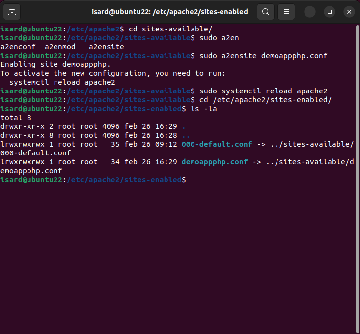

> [!NOTE]  
> Como en node, para el manejo de las bases de datos he cambiado el usuario a uno llamado 'demo' con contraseña 'password'

### TOQUES FINALES Y PRUEBAS

Deberemos añadir 2 lineas a (/etc/hosts) para que podamos ver las aplicaciones ya que no dispodemos de un dominio real y estamos en local.

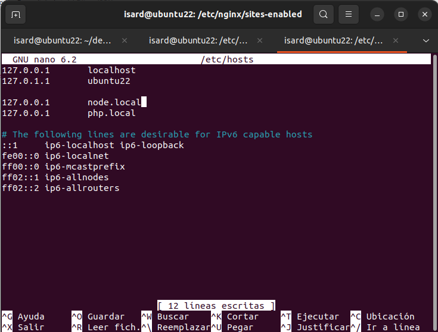

Finalmente probamos las dos aplicaiones.

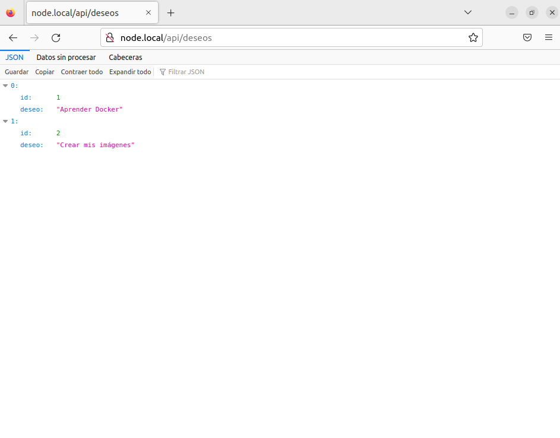

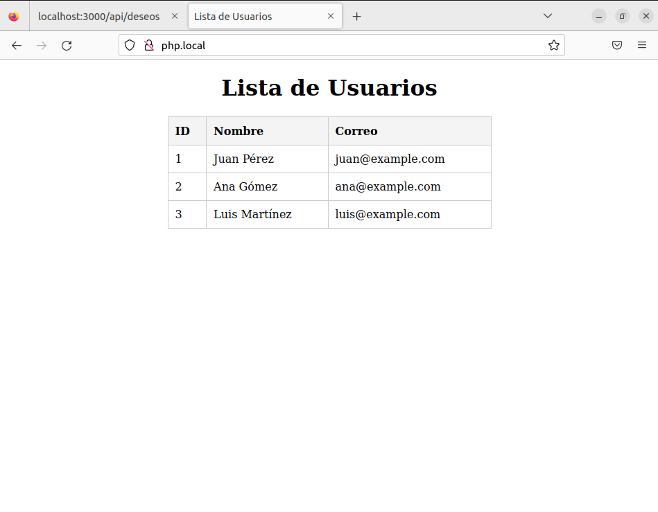

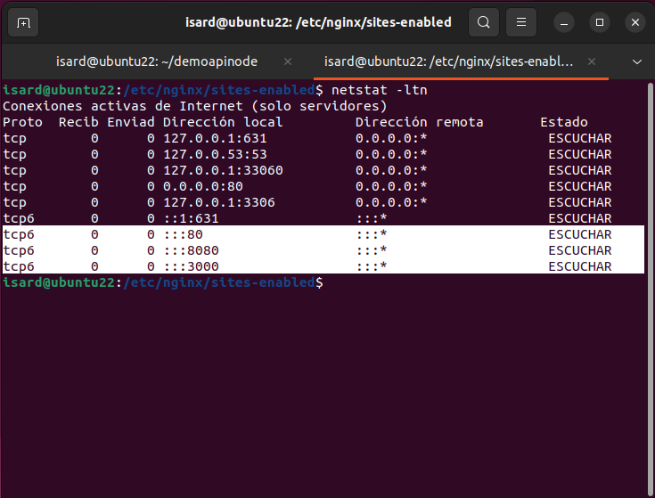

