# PRACTICA 2
## Por David Rubio (Dominio: elpais.com)

### Herramienas de diagnostico
* #### Busca la IP asignada
Para ello simplemente ejecutamos el comando: "host elpais.com" 
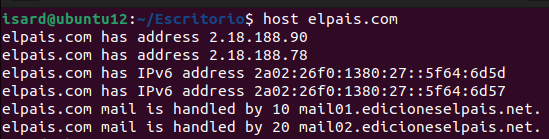
* #### Quien resuelve su DNS
Para averiguar quien devuelve el DNS ejecutamos el comando "dig elpais.com NS" y nos devuelve con un poco de busqueda en google (whois) que pertenece auna empresa llamada "Akamai Technologies, Inc."

* #### Cuál es el servidor de correo electrónico. Si hay varios, determina cual es primero por su prioridad.
Utilizando el comando "host -t MX elpais.com" nos devuelve que hay 2 servidores de correos siendo el 1 el prioritario pues tienes menor numero
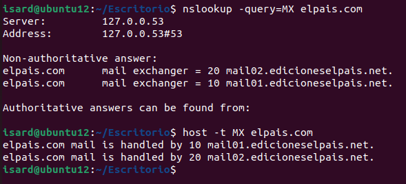
* #### Haz la búsqueda de forma autorizada, es decir, que el servidor que contesta sea uno de los registos NS del dominio.
Para realizar una busqueda autorizada le preguntaremos al DNS que nos ha devuelto antes el comando dig
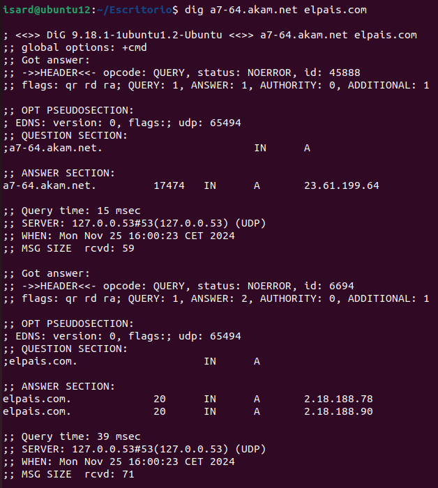

### Suplantar DNS localmene
Primero modificaremos el archivo "/etc/host" para añadir los directorios
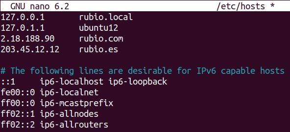
Luego provamos con el comando Host que el cambio funciona
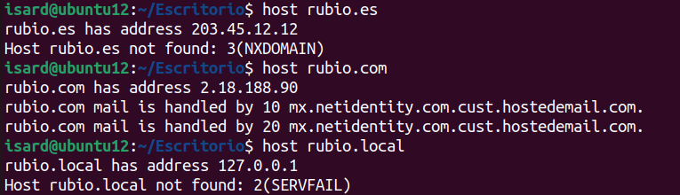
Finalmente le preguntamos a google al respecto
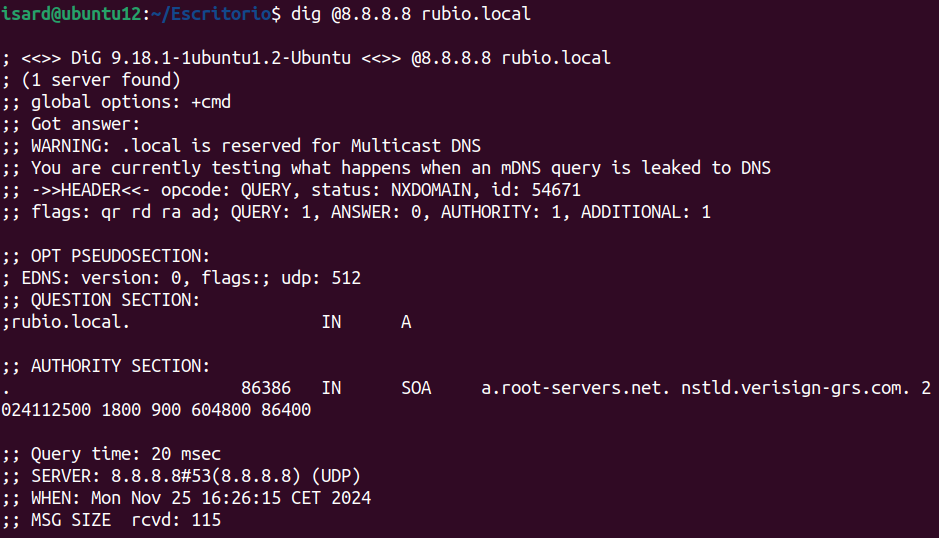
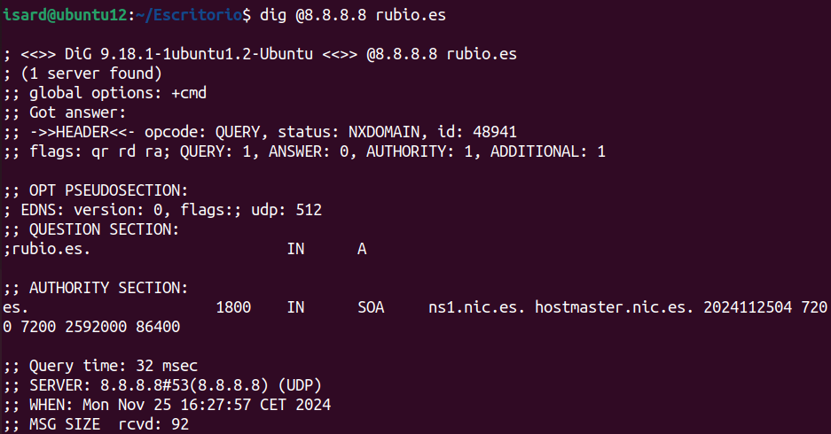
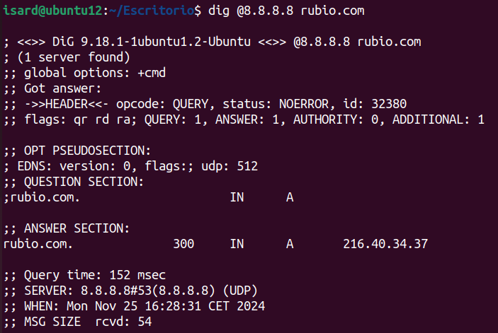

### Configuracion del servidor DNS con BIND9

Empezamos instalando Bind9 en el servidor y habilitando el proceso
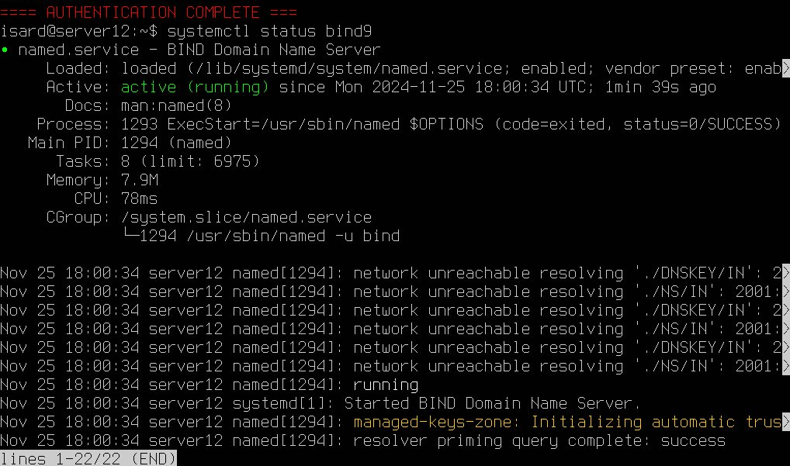
Configuramos la zona
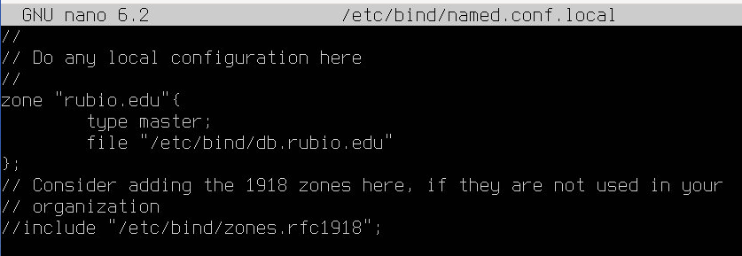
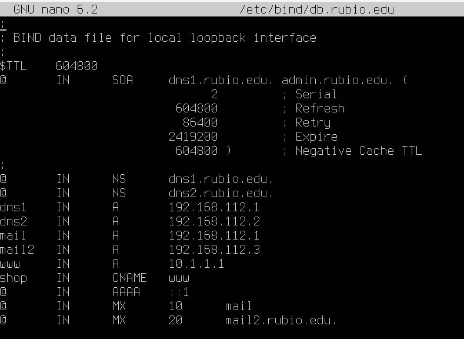
Y comprobamos que se ha formado bien
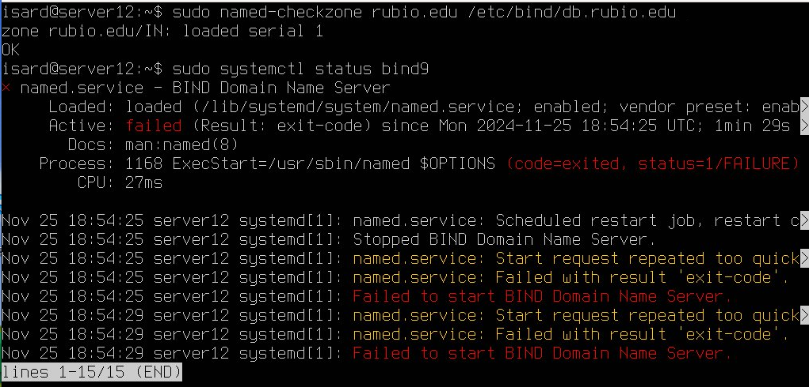
Aqui me da un fallo que no consigo solucionar, no se si he instalado algo mal o tengo algun fallo por atras
Si hubiera salido bien habria que comprobarlo con los comandos dig y nslookup los dominios establecidos

